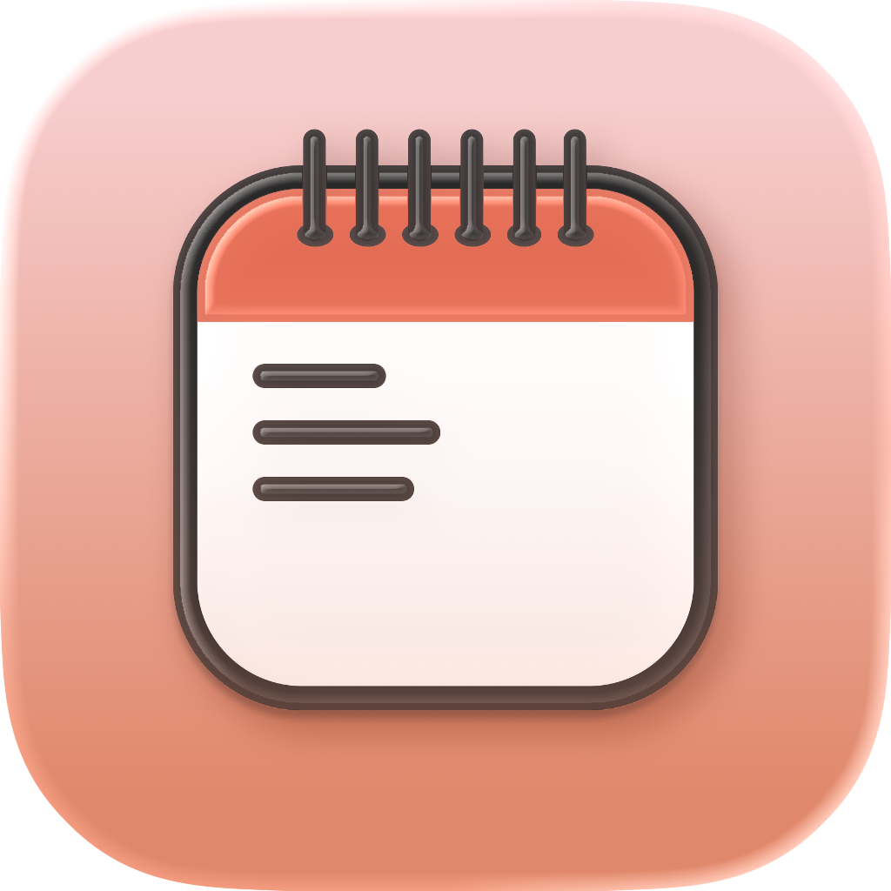

# Countie
> Track life's milestones, one countdown at a time.

Countie is an iOS countdown app built with SwiftUI. It lets you create custom countdowns, link countdowns to calendar events, and surface upcoming events through Home Screen and Lock Screen widgets.

<table>
<thead>
<td>Home Page</td>
<td>Add New Countdown</td>
<td>Countdown Details</td>
<td>Edit Countdown</td>
<td>Widget Preview</td>
</thead>
  <tr>
    <td></td>
    <td></td>
    <td></td>
    <td></td>
    <td></td>
  </tr>
</table>

## Current State
- Native iOS app in active development
- Main app target plus two widget extension targets
- Local persistence is implemented with SwiftData
- Calendar-linked countdown syncing is implemented with EventKit
- Basic unit and UI test targets exist, but coverage is still minimal

## Features
- Create custom countdowns with a title, emoji, target date, and optional time of day
- Set a custom "count since" date to show progress toward an event
- Browse upcoming countdowns and separate past countdowns
- Search countdowns from the main list
- View a dedicated countdown detail screen with a live second-by-second timer
- Edit future countdowns and soft-delete countdowns
- Import countdowns from calendar events
- Keep linked countdowns synced when the source calendar event changes
- Open countdown details from widget deep links
- Configure a single-countdown widget with App Intents
- Show multiple upcoming countdowns in a dedicated multi-countdown widget
- Support Home Screen and Lock Screen widget families including `systemSmall`, `systemMedium`, `accessoryInline`, `accessoryCircular`, and `accessoryRectangular`

## Tech Stack
- Swift 5
- SwiftUI for the app UI
- SwiftData for persistence
- WidgetKit for widgets
- App Intents for widget configuration
- EventKit for calendar integration
- XCTest for UI tests
- Swift Testing (`Testing`) for unit test scaffolding

## Project Structure
```text
Countie/                 Main iOS app
CountdownWidget/         Single countdown widget extension
MultipleCountdownWidget/ Multi-countdown widget extension
CountieTests/            Unit tests
CountieUITests/          UI tests
```

## Requirements
- Xcode with iOS 18.1 SDK support
- iOS 18.1 deployment target
- Apple developer signing setup if you want to run widgets on device

## Running The Project
1. Open `/Users/nabil/Documents/programming/noma/Countie.xcodeproj` in Xcode.
2. Select the `Countie` scheme.
3. Build and run on an iOS 18.1 simulator or device.
4. Grant Calendar access if you want to create countdowns from calendar events.

## Notes And Gaps
- The settings screen currently exposes progress display preferences and support links.
- Reminder model code exists, but reminder scheduling is not wired into the UI yet.
- A Live Activity widget file exists in the widget target, but it is still placeholder-level.
- Some settings options are scaffolded in code and currently commented out.

## Status
This repository reflects a working SwiftUI countdown app with calendar integration and widgets, rather than just an early prototype. The app is usable today, but there are still a few unfinished areas around reminders, support metadata, and test depth.
