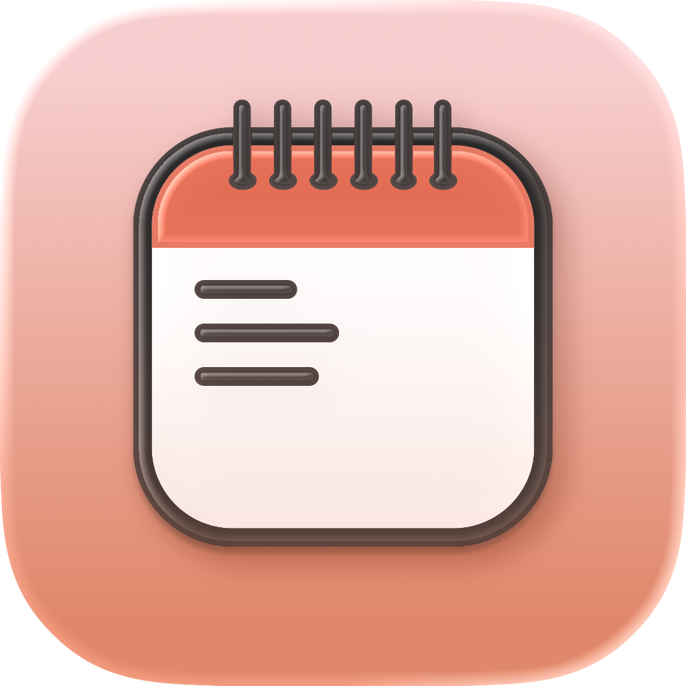

# Countie
> Track life's milestones, one countdown at a time.

Countie is an iOS countdown app built with SwiftUI. It lets you create custom countdowns, link countdowns to calendar events, and surface upcoming events through Home Screen and Lock Screen widgets.

<table>
<thead>
<td>Home Page</td>
<td>Add New Countdown</td>
<td>Countdown Details</td>
<td>Edit Countdown</td>
<td>Widget Preview</td>
</thead>
  <tr>
    <td></td>
    <td></td>
    <td></td>
    <td></td>
    <td></td>
  </tr>
</table>

## Current State
- Native iOS app in active development with a usable SwiftUI app flow
- Main app target plus two WidgetKit extension targets
- Local persistence is implemented with SwiftData through a shared model container
- Calendar browsing, import, and linked-event syncing are implemented with EventKit
- App Shortcuts and App Intents are available for common countdown actions
- Unit tests cover model defaults, soft deletion, and calendar-event matching; UI tests are still scaffold-level

## Features
- First-launch onboarding with calendar permission guidance
- Create custom countdowns with a title, icon, color, target date, and time of day
- Choose from curated SF Symbol icons and color themes for each countdown
- Track countdown progress from the stored start date
- Browse upcoming countdowns grouped by month and view past countdowns separately
- Search countdowns from list views
- View a dedicated countdown detail screen with a live second-by-second timer
- Celebrate a countdown reaching zero with confetti
- Edit future countdowns and soft-delete countdowns from the detail view
- Keep linked countdowns synced when the source calendar event changes or is removed
- Unlink a countdown from its calendar event during editing
- Open countdown details from widget deep links
- Configure a single-countdown widget with App Intents
- Show multiple upcoming countdowns in a dedicated multi-countdown widget
- Support Home Screen and Lock Screen widget families including `systemSmall`, `systemMedium`, `accessoryInline`, `accessoryCircular`, and `accessoryRectangular`
- Use App Shortcuts to create, open, show the next, or delete countdowns

## Tech Stack
- Swift 5
- SwiftUI for the app UI
- SwiftData for persistence
- WidgetKit for widgets
- App Intents and App Shortcuts for widget configuration and system actions
- EventKit for calendar integration
- ConfettiSwiftUI for completion celebration effects
- XCTest for UI tests
- Swift Testing (`Testing`) for unit tests

## Project Structure
```text
Countie/                 Main iOS app
Countie/AppIntents/      App Intents, App Entities, and App Shortcuts
Countie/Model/           SwiftData models, stores, and shared model container
Countie/Screens/         App screens, including onboarding and settings
Countie/Views/           Reusable SwiftUI views
CountdownWidget/         Single countdown widget extension
MultipleCountdownWidget/ Multi-countdown widget extension
CountieTests/            Unit tests
CountieUITests/          UI tests
```

## Requirements
- Xcode with iOS 18.1 SDK support
- iOS 18.1 deployment target
- Apple developer signing setup if you want to run widgets on device
- Calendar permission is optional, but required for event browsing and imports

## Running The Project
1. Open `Countie.xcodeproj` in Xcode.
2. Select the `Countie` scheme.
3. Build and run on an iOS 18.1 simulator or device.
4. Grant Calendar access if you want to create countdowns from calendar events.

## Notes And Gaps
- The main add button currently opens manual countdown creation; the calendar import screen exists and is wired, but its menu entry is commented out in the main toolbar.
- The settings screen currently exposes progress display preferences, onboarding replay, and placeholder support links.
- Some settings options are scaffolded in code and currently commented out.
- A Live Activity widget file exists in the widget target, but it is still placeholder-level.
- UI tests launch the app and measure launch performance, but do not yet exercise core flows.

## Status
This repository reflects a working SwiftUI countdown app with onboarding, persistence, calendar integration, App Intents, and widgets. The app is usable today, with remaining polish around calendar import discoverability, support metadata, Live Activity behavior, and deeper UI test coverage.
